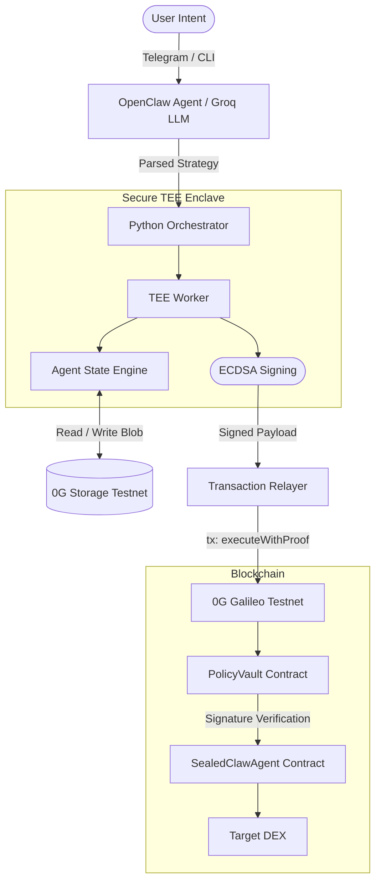

# SealedClaw - Sovereign iNFT Trading Agent

## Project Overview

SealedClaw is an advanced autonomous, sovereign iNFT trading agent framework built natively for the 0G ecosystem. The project leverages **OpenClaw SDK**, **0G Storage**, and a customized Python-based **TEE (Trusted Execution Environment)** worker to orchestrate cryptographically secure, AI-driven on-chain trading strategies.

Rather than relying purely on centralized servers or unverified bot scripts, SealedClaw operates under an "Intent-driven" execution model:
1. Users provide high-level intents (e.g., "Optimize yield with max 5% risk") via an NLP interface (Telegram Bot / CLI).
2. The bot uses the Groq-powered Llama 3 LLM (migrated from OpenAI for cost-efficiency and decentralization) to parse trading intent.
3. The TEE worker processes the strategy within a secure enclave, interacting with real-time on-chain data and producing an ECDSA signature over the payload.
4. The strategy payload is cached to 0G Storage for persistent cross-cycle memory.
5. A smart contract (`PolicyVault`) deployed on the 0G Galileo testnet validates the TEE's signature before allowing execution on a target DEX.
6. **Command Center Dashboard**: A premium React-based management interface for monitoring agents and trading assets on the "Forge" marketplace.

---

## System Architecture

SealedClaw combines off-chain AI reasoning, secure enclave execution, and on-chain verification.



### Technical Description
- **OpenClaw Agent Layer**: Parses raw human intelligence statements into actionable protocol parameters utilizing an LLM mechanism.
- **TEE Subprocess Enclave**: Ensures that the execution and generation of the signature was processed faithfully according to the strategy without data tampering or leakage.
- **0G Infrastructure Layer**: 
   - 0G EVM Galileo confirms the cryptographic signature matching the authorized TEE public key.
   - 0G Storage acts as the decentralized memory cache so the agent can remember past trading contexts.
- **Frontend Layer**: A Vite-powered React application that provides real-time visualization of oracle data, risk management controls, and the agent marketplace.

---

## 0G Modules Used & How They Support The Product

### 1. 0G Galileo Testnet (EVM)
- **What it is:** The modular Layer 1 execution environment for 0G.
- **How it supports the product:** Hosts the `SealedClawAgent` and `PolicyVault` ERC-7857 compliant smart contracts. The Galileo testnet acts as the immutable verification layer. It guarantees that trades can only be routed to a Decentralized Exchange (DEX) if the transaction strictly carries a valid ECDSA signature from the registered TEE public key, thereby preventing replay attacks via dynamic on-chain nonces.

### 2. 0G Storage
- **What it is:** The modular Decentralized Storage network integrated into the 0G ecosystem.
- **How it supports the product:** Autonomous agents require "memory" to preserve context between iterations (e.g., tracking moving averages or evaluating past trade performances). Storing complete agent states entirely on-chain is expensive. SealedClaw securely uploads the encrypted TEE execution memory JSON to **0G Storage** (`https://rpc-storage-testnet.0g.ai`) returning a `file_root_hash`. During the next cycle, the TEE worker fetches this blob from 0G Storage, allowing the agent to continuously execute stateful, time-aware intent trading without clogging EVM blockspace.

### 3. 0G Verifiable Compute (TEE)
- **What it is:** The secure execution layer for 0G that ensures computations are correct and private.
- **How it supports the product:** SealedClaw uses a **TEE Worker** (simulated for TEE-hardware compatibility) to handle the sensitive "brains" of the trading operation. By executing the trading strategy inside a Trusted Execution Environment, the project ensures that:
    - The private keys used for signing transactions are never exposed (even to the node operator).
    - The trading logic hasn't been tampered with or modified.
    - The ECDSA signature produced is cryptographically linked to the specific TEE code (attestation).
    This transforms a simple trading bot into a **Sovereign iNFT Agent** that has its own identity and verifiable integrity.

---

## Local Deployment & Reproduction Steps

### Prerequisites
- Node.js (v18+)
- Python (3.10+) 
- A wallet with 0G Galileo Testnet Tokens.

### Step 1: Environment Setup
Clone the repository and prepare the environment variables.

```bash
git clone <your-repo-url>
cd SealedClaw

# Copy default env
cp .env.example .env
```
Edit `.env` and fill in your keys:
```env
PRIVATE_KEY=your_wallet_private_key
RPC_URL=https://evmrpc-testnet.0g.ai
RELAYER_PRIVATE_KEY=your_relayer_private_key
TELEGRAM_BOT_TOKEN=your_telegram_bot_token # (optional)
GROQ_API_KEY=your_groq_api_key_here
```

### Step 2: Smart Contract Deployment
Deploy the contracts to the 0G Galileo Testnet.

```bash
npm install
npx hardhat compile
npx hardhat run scripts/deploy.ts --network galileo
```
*Note down the deployed contract addresses (PolicyVault, StrategyVault, etc.) and add them to your `.env`.*

### Step 3: Python Environment & Agent Initialization
Install Python dependencies and run the OpenClaw orchestrator to trigger a trading cycle.

```bash
# Optional: Setup virtual environment
# python -m venv venv && source venv/bin/activate

pip install -r requirements.txt

# Option A: Run single CLI strategy execution
python orchestrator.py

# Option B: Run via interactive Telegram Bot
python telegram_bot.py

### Step 4: Launch Frontend
Enter the frontend directory and start the development server.

```bash
cd frontend
npm install
npm run dev
```
Explore the dashboard at `http://localhost:5173`.
```

---

## Reviewer Notes & Test Accounts

- **0G Galileo Faucet:** To test the product, ensure your `PRIVATE_KEY` and `RELAYER_PRIVATE_KEY` wallets are funded. You can obtain testnet `$A0GI` tokens at the official [0G Faucet](https://faucet.0g.ai).
- **Groq API Fallback:** The codebase has been migrated to use `Groq` for high-speed, free Llama 3 inference. If you do not provide a `GROQ_API_KEY` (or `OPENAI_API_KEY`), the `orchestrator.py` script contains a graceful fallback that bypasses the NLP reasoning and natively executes the default `execute_sealed_trade` skill for testing/judging purposes.
- **Smart Contract Verification:** Ensure that `TEE_PUB_KEY` is properly whitelisted in the `PolicyVault` contract upon deployment for end-to-end ECDSA signature verification to succeed.
