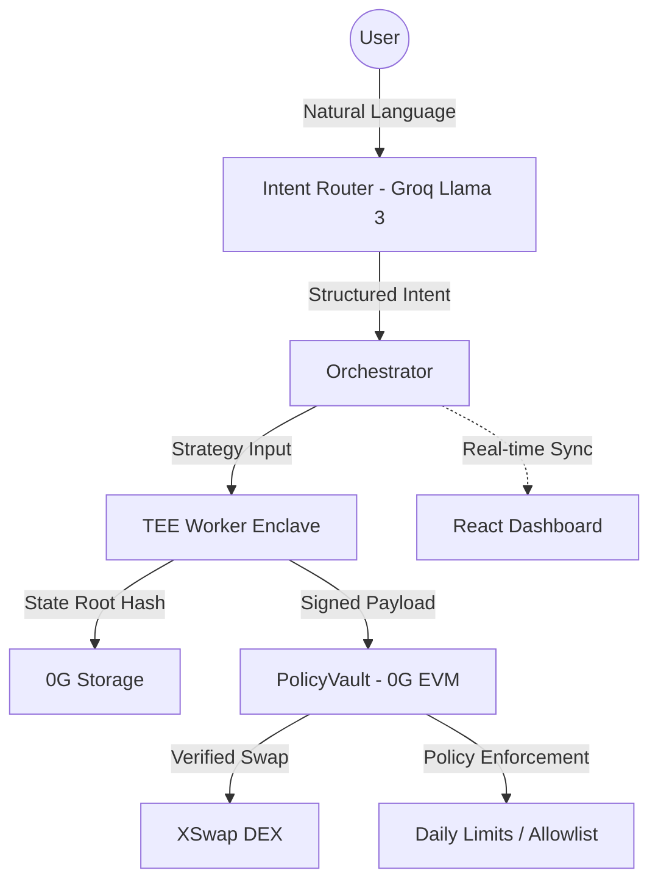

# SealedClaw — Sovereign iNFT Trading Agent on 0G

> **Official 0G Hackathon Submission**  
> Deployed on **0G Aristotle Mainnet** (ChainID: 16661).

---

## 📖 Project Overview
SealedClaw is an autonomous, TEE-secured AI trading agent framework built natively for the 0G ecosystem. It solves the critical challenge of "trust" in agentic DeFi by combining off-chain AI intelligence with on-chain risk enforcement.

In SealedClaw, agents are represented as **ERC-7857 iNFTs** (intelligent NFTs). Each agent is a self-custodial asset linked to a dedicated **PolicyVault** that enforces safety rules (daily limits, DEX allowlists) on-chain. Trading decisions are made by an advanced AI model (Llama 3 via Groq) running inside a **Trusted Execution Environment (TEE)**. The TEE enclave cryptographically signs every transaction, providing proof that the trade was generated by the authorized AI logic without human intervention or tampering.

### Key Features
- **Sovereign iNFTs**: Agents and their balances are fully transferable digital assets.
- **TEE-Secured Intelligence**: Private, verifiable strategy execution off-chain.
- **On-Chain Guardrails**: Real-time enforcement of risk policies via 0G EVM.
- **Persistent Memory**: Decentralized agent "brains" stored on 0G Storage.

---

## 🏗️ System Architecture
SealedClaw utilizes a three-layer architecture to ensure security and scalability.



### Technical Description
1.  **Intelligence Layer**: A Groq-powered Llama 3 LLM parses natural language intents (e.g., via Telegram) and generates structured trading parameters.
2.  **Execution Layer (TEE)**: A Python-based enclave worker (running inside a TEE) processes the strategy. It fetches real-time prices, analyzes market sentiment, and generates an ECDSA signature over the trade payload.
3.  **Verification Layer (0G EVM)**: The `PolicyVault` contract recovers the TEE signer via `ecrecover` and ensures all on-chain risk policies (e.g., daily spend limit) are met before routing the trade to a DEX adapter.

---

## 🔧 0G Modules Used & Support
| 0G Module | Usage in SealedClaw | Support for the Product |
|---|---|---|
| **0G Chain (EVM)** | Host for all core contracts including `PolicyVault`, `SealedClawAgent`, and `AgentMarketplace`. | Provides a high-performance, modular execution layer where TEE signatures are verified trustlessly and funds are secured. |
| **0G Storage** | Persisting agent memory (trade history, indicators, and reasoning blobs). | Enables stateful agent memory across trading cycles without the high cost of on-chain storage, ensuring the agent "remembers" context. |
| **0G Compute** | Secure execution of the strategy engine and ECDSA signing of trade payloads via Python enclave. | Guarantees that the agent's decision-making logic is private and tamper-proof, preventing operator interference. |
| **Agent ID (iNFT)** | Implementing the ERC-7857 standard for Intelligent NFTs to represent autonomous agents. | Provides a sovereign identity for each agent, allowing them to be owned, traded, and managed as unique digital assets. |
| **Secure Execution (TEE)** | Deep integration with Trusted Execution Environments for signing verifiable trade proofs. | Ensures end-to-end privacy for the agent's strategy, fulfilling the highest standards of secure DeFi execution. |

---

## 🚀 Local Deployment & Reproduction Steps

### Prerequisites
- **Node.js v18+** & **Python 3.11+**
- **Docker & Docker Compose**
- A wallet funded with **$0G tokens** on 0G Aristotle Mainnet.

### Step 1: Configuration
```bash
git clone https://github.com/Prestige14/SealedClaw
cd SealedClaw
cp .env.example .env
```
Fill in `.env` with your `PRIVATE_KEY`, `RELAYER_PRIVATE_KEY`, and `GROQ_API_KEY`.
Set `MAINNET_RPC_URL=https://rpc.ankr.com/0g_mainnet_evm`.

### Step 2: Deploy Contracts (Optional)
```bash
npm install
npx hardhat compile
npx hardhat run scripts/deploy.ts --network og_mainnet
```

### Step 3: Launch Backend (Docker)
```bash
# Builds and starts the FastAPI Bridge and Orchestrator
docker-compose up --build -d
```

### Step 4: Launch Frontend
```bash
cd frontend
npm install
npm run dev
```
Open `http://localhost:5173` to view the **Agent Neural Link** and dashboard.

---

## 📋 Reviewer Notes & Test Details

### 0G Aristotle Mainnet (ChainID: 16661)
| Contract | Address |
|---|---|
| **SealedClawAgent (iNFT)** | [`0xD836bC71C9ECAe447F3f323d9C4E982A0ad178D2`](https://chainscan.0g.ai/address/0xD836bC71C9ECAe447F3f323d9C4E982A0ad178D2) |
| **PolicyVault** | [`0xBe9Db7735B06FEa557f3Aa18317eaB229BA6ebC5`](https://chainscan.0g.ai/address/0xBe9Db7735B06FEa557f3Aa18317eaB229BA6ebC5) |
| **StrategyManager** | [`0xFAB206535E521be5B24AeEf30b3CB71f7bf21459`](https://chainscan.0g.ai/address/0xFAB206535E521be5B24AeEf30b3CB71f7bf21459) |
| **SimpleTestAdapter (DEX)** | [`0x0e0EE41CCbf977f8D54d601309FD8EBcbeAF7A18`](https://chainscan.0g.ai/address/0x0e0EE41CCbf977f8D54d601309FD8EBcbeAF7A18) |
| **AgentMarketplace** | [`0x9f822E2aF82344a2790bee0D5C20701A677Ca637`](https://chainscan.0g.ai/address/0x9f822E2aF82344a2790bee0D5C20701A677Ca637) |
| **OracleVerifier** | [`0x29b48D4e24c2D9012aD286647632bEec16EF06c2`](https://chainscan.0g.ai/address/0x29b48D4e24c2D9012aD286647632bEec16EF06c2) |
| **AttestationRegistry** | [`0x60aC7E3E0e7D498fCa1d7F526BB21F90d1E43D5F`](https://chainscan.0g.ai/address/0x60aC7E3E0e7D498fCa1d7F526BB21F90d1E43D5F) |

### Reviewer Instructions
1.  **Neural Link**: The dashboard features an "Agent Neural Link" status bar that polls the backend API (`/status`) to show real-time "thinking" processes.
2.  **Reasoning**: Check the `orchestrator` logs to see the agent's detailed rationale generation for each trade.
3.  **Faucet**: For Mainnet tokens, please use official 0G community faucets or bridges.

---

## 📜 License
MIT
